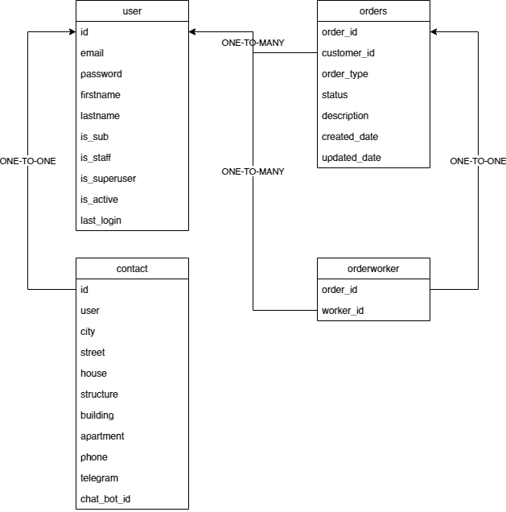

# My CRM. Тестовое задание для ДомКлик.

### Развернуто на Heroku [pavlenko-my-crm.herokuapp.com](https://pavlenko-my-crm.herokuapp.com)

CRM для регистрации и обработки
входящих заявок от пользователей.

Возможности:

**User:**
* Регистрация пользователей (статус staff выдается вручную в админке);
* Сброс пароля по email;
* LogIn/LogOut;
* Просмотр деталей залогиневшегося пользователя (для staff - любого пользователя);
* Изменение данных пользователя, добавление контактов для залогиневшегос пользователя. (для staff - любого пользователя);
* Просмотр списка всех пользователейю (**только для staff**);
* Подписка на оповещение об изменении статуса заявки посредством использования телеграм-бота;

**Order:**
* Просмотр списка всех заказов (**только для staff**);
* Просмотр списка заказов залогиневшегося пользователя;
* Просмотр списка заказов конкретного пользователя (**только для staff**);
* Просмотр деталей заказа залогиневшегося пользователя (для staff - любого заказа);
* Изменение заказа (для staff доступны дополнительные поля);
* Создание заказа (для staff доступны дополнительные поля);
* Удаление заказа (для обычного пользователя доступно только для заказов со статусом NEW);

#### Настройки:

Приложение работает с базой **PostgreSQL** и **google smtp server** для отправки email.

Для работы потребуется добавить файл local_settings.py с полями:

    EMAIL_HOST_USER = ''
    EMAIL_HOST_PASSWORD = ''
    
    DATABASE = {
            'ENGINE': '',
            'NAME': '',
            'USER': '',
            'PASSWORD': '',
            'HOST': '',
            'PORT': '',
        }
    
    TELEGRAM_TOKEN = ''
    TELEDRAM_BOT_NAME = ''

#### Схема БД:
 

Также основная часть функционала покрыта тестамти.

